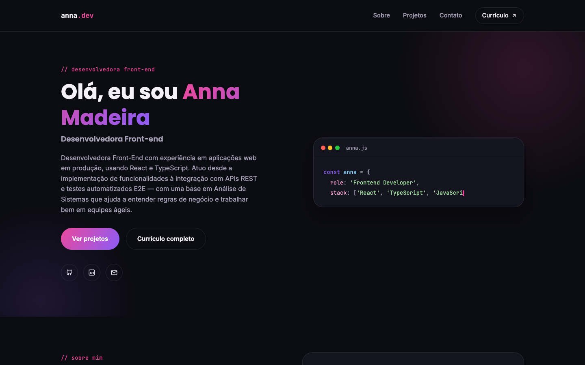
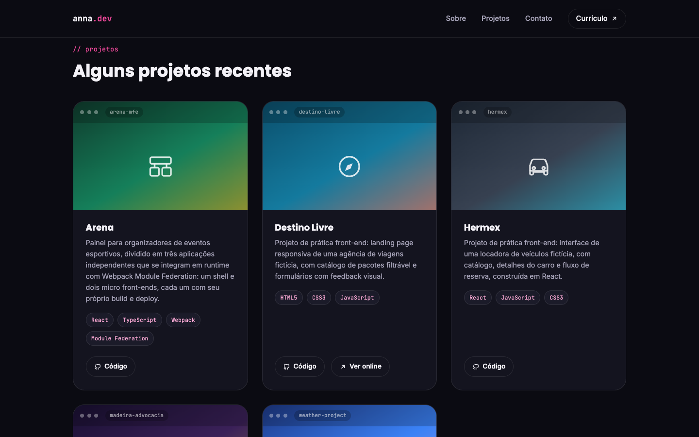

# Anna Madeira — Portfólio

Site pessoal de portfólio, construído com HTML, CSS e JavaScript puros. Apresenta uma seção sobre, stack técnica e os projetos mais recentes, com links para o código de cada um no GitHub.

🔗 **[anna-madeira.github.io](https://anna-madeira.github.io/)**

## Telas

<p align="center">
  
  &nbsp;
  
</p>

<p align="center">
  
</p>

## Seções

- **Home** — apresentação rápida e stack principal
- **Sobre** — trajetória (de análise de sistemas para front-end) e ferramentas
- **Projetos** — cards com destaque para os projetos mais recentes no GitHub
- **Contato** — e-mail, LinkedIn e GitHub

## Tecnologias

- HTML5 semântico
- CSS3 (Grid, Flexbox, variáveis CSS, tema escuro) — modularizado em um arquivo por seção
- JavaScript vanilla (menu mobile, efeito de digitação no bloco de código e modal com o currículo)

## Rodando localmente

```bash
python3 -m http.server 4174
```

Depois acesse `http://localhost:4174`.
